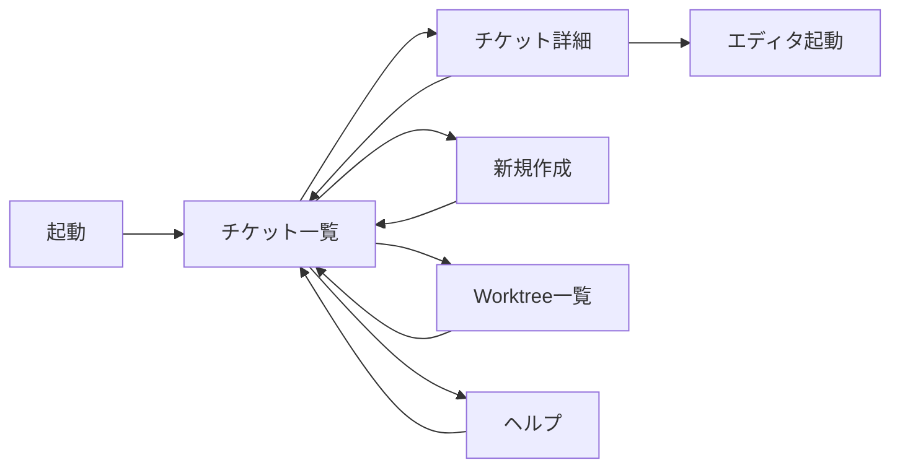

# TicketFlow 包括的設計書

## 1. システム概要

### 1.1 概要

TicketFlowは、生成AIとの協働に最適化されたgit worktreeベースのチケット管理システムです。ticket.shの設計思想を継承しつつ、worktree統合による並行作業のサポートとモダンなUIを提供します。

### 1.2 主な特徴

- **Markdown + YAML frontmatter**によるチケット管理
- **Git worktree**による並行作業のサポート
- **ディレクトリベースの状態管理**（todo/doing/done）
- **人間向けTUI**とAI向けCLIの両立
- **PRベースのワークフロー**（自動merge/pushなし）
- **フラットなworktree構造**でシンプルな管理

### 1.3 設計原則

1. **シンプル**: 外部サービスへの依存なし、ローカルで完結
2. **明示的**: 自動的なGit操作は最小限、ユーザーが制御
3. **透明性**: チケットの状態がディレクトリ構造で可視化
4. **柔軟性**: AI/人間どちらも使いやすいインターフェース

## 2. システム構成

### 2.1 技術スタック

- **言語**: Go
- **TUIフレームワーク**: Bubble Tea (github.com/charmbracelet/bubbletea)
- **設定ファイル**: YAML (gopkg.in/yaml.v3)
- **テスト**: testify (github.com/stretchr/testify)

### 2.2 ディレクトリ構造

#### プロジェクト構造
```
ticketflow/                          # ツールのソースコード
├── cmd/
│   └── ticketflow/
│       └── main.go                  # エントリーポイント
├── internal/
│   ├── config/                      # 設定管理
│   │   ├── config.go
│   │   └── config_test.go
│   ├── ticket/                      # チケット管理
│   │   ├── ticket.go               # チケットモデル
│   │   ├── manager.go              # チケット操作
│   │   └── status.go               # 状態管理
│   ├── git/                        # Git操作
│   │   ├── git.go                  # Git基本操作
│   │   └── worktree.go             # Worktree管理
│   ├── cli/                        # CLIインターフェース
│   │   ├── app.go                  # アプリケーション
│   │   ├── commands.go             # コマンド実装
│   │   ├── output.go               # 出力フォーマット
│   │   └── errors.go               # エラーハンドリング
│   └── ui/                         # TUIインターフェース
│       ├── app.go                  # TUIアプリケーション
│       ├── views/                  # 各画面
│       │   ├── list.go
│       │   ├── detail.go
│       │   ├── new.go
│       │   └── worktree.go
│       └── styles/                 # スタイル定義
│           └── theme.go
├── test/                           # テスト
│   ├── integration/
│   ├── e2e/
│   └── testutil/
├── .gitignore
├── go.mod
├── go.sum
├── Makefile
└── README.md
```

#### ユーザープロジェクト構造
```
project/                             # ユーザーのプロジェクト
├── .ticketflow.yaml                # 設定ファイル
├── tickets/                        # チケット管理ディレクトリ
│   ├── todo/                       # 未開始チケット
│   │   └── 250125-093000-add-tests.md
│   ├── doing/                      # 作業中チケット
│   │   └── 250124-150000-implement-auth.md
│   └── done/                       # 完了チケット
│       └── 250123-110000-setup-ci.md
├── current-ticket.md               # 現在のチケットへのシンボリックリンク
└── src/                           # プロジェクトのソースコード

../.worktrees/                      # Worktreeディレクトリ（フラット構造）
├── 250124-150000-implement-auth/   # 親タスク
├── 250124-153000-user-model/      # サブタスク（親と同階層）
└── 250124-153100-user-auth/       # サブタスク（親と同階層）
```

## 3. データ構造

### 3.1 チケットファイル形式

```yaml
---
# 基本メタデータ（ticket.sh互換）
priority: 2                          # 優先度 (1-3)
description: "ユーザー認証APIの実装"    # 簡潔な説明
created_at: "2025-01-24T10:00:00Z"   # 作成日時（ISO 8601）
started_at: null                     # 開始日時（作業開始時に設定）
closed_at: null                      # 完了日時（クローズ時に設定）

# 拡張フィールド（オプション）
related: ["250123-140000-api-design"] # 関連チケットID（親タスクなど）
---

# チケットタイトル

## 概要

チケットの詳細な説明をここに記述します。

## タスク
- [ ] JWT生成ロジックの実装
- [ ] 認証ミドルウェアの作成
- [ ] リフレッシュトークン対応

## メモ

実装に関する追加情報や注意事項。
```

### 3.2 チケットの状態

チケットの状態はディレクトリとメタデータから決定されます：

| 状態 | ディレクトリ | started_at | closed_at |
|------|------------|------------|-----------|
| TODO | `todo/` | null | null |
| DOING | `doing/` | 設定済み | null |
| DONE | `done/` | 設定済み | 設定済み |

### 3.3 設定ファイル (.ticketflow.yaml)

```yaml
# Git設定
git:
  default_branch: "main"             # デフォルトブランチ
  
# Worktree設定
worktree:
  enabled: true                      # worktree機能の有効/無効
  base_dir: "../.worktrees"          # worktreeのベースディレクトリ
  
  # worktree作成後の初期化コマンド
  init_commands:
    - "git fetch origin"
    # - "npm install"
    # - "make setup"
    
# チケット設定  
tickets:
  dir: "tickets"                     # チケットディレクトリ
  
  # 状態別のサブディレクトリ
  todo_dir: "todo"
  doing_dir: "doing"
  done_dir: "done"
  
  # 新規チケットのテンプレート
  template: |
    # 概要
    
    ## タスク
    - [ ] 
    
    ## メモ

# 出力設定
output:
  default_format: "text"             # デフォルト出力形式 (text|json)
  json_pretty: true                  # JSON整形出力
```

## 4. コマンド仕様

### 4.1 コマンド一覧

| コマンド | 説明 | 実行可能な場所 |
|---------|------|---------------|
| `ticketflow` | TUI起動 | どこでも |
| `ticketflow init` | システム初期化 | Gitリポジトリ |
| `ticketflow new <slug>` | チケット作成 | どこでも（警告付き） |
| `ticketflow list` | チケット一覧 | メインリポジトリ |
| `ticketflow show <id>` | チケット詳細 | メインリポジトリ |
| `ticketflow start <id>` | 作業開始 | メインリポジトリ/worktree |
| `ticketflow close` | 作業完了 | worktree |
| `ticketflow restore` | リンク復元 | worktree |
| `ticketflow cleanup <id>` | 後片付け | メインリポジトリ |
| `ticketflow worktree list` | worktree一覧 | メインリポジトリ |

### 4.2 各コマンドの詳細

#### init - システム初期化
```bash
ticketflow init
```
- `.ticketflow.yaml`を作成
- `tickets/todo`、`tickets/doing`、`tickets/done`ディレクトリを作成
- `.gitignore`に`current-ticket.md`を追加

#### new - チケット作成
```bash
ticketflow new implement-auth
```
- slugは英小文字、数字、ハイフンのみ
- `YYMMDD-HHMMSS-<slug>`形式のIDを生成
- `tickets/todo/`ディレクトリに作成
- どのブランチでも実行可能（mainブランチ以外では警告）

#### start - 作業開始
```bash
ticketflow start 250124-150000-implement-auth
```
1. 新しいworktreeとブランチを作成
2. チケットを`todo/` → `doing/`に移動
3. `started_at`を設定
4. 初期化コマンドを実行
5. `current-ticket.md`シンボリックリンクを作成

**サブチケットの場合**（worktree内から実行）:
- 現在のブランチから分岐
- 親と同じ階層の`../.worktrees/`に作成
- `related`フィールドに親チケットIDを自動設定

#### close - 作業完了
```bash
ticketflow close
```
1. チケットを`doing/` → `done/`に移動
2. `closed_at`を設定
3. 変更をコミット
4. **マージやプッシュは行わない**
5. PR作成を案内

#### cleanup - 後片付け
```bash
ticketflow cleanup 250124-150000-implement-auth
```
PRマージ後の後片付け：
- worktreeを削除
- ローカルブランチを削除

### 4.3 JSON出力

読み取り系コマンドは`--format json`オプションでJSON出力可能：

```json
{
  "tickets": [
    {
      "id": "250124-150000-implement-auth",
      "path": "tickets/doing/250124-150000-implement-auth.md",
      "status": "doing",
      "priority": 1,
      "description": "ユーザー認証APIの実装",
      "created_at": "2025-01-24T15:00:00Z",
      "started_at": "2025-01-24T15:30:00Z",
      "closed_at": null,
      "related": [],
      "has_worktree": true,
      "worktree_path": "../.worktrees/250124-150000-implement-auth"
    }
  ],
  "summary": {
    "total": 5,
    "todo": 2,
    "doing": 1,
    "done": 2
  }
}
```

## 5. ワークフロー

### 5.1 基本的なワークフロー

```bash
# 1. システム初期化（初回のみ）
[main]$ ticketflow init

# 2. チケット作成
[main]$ ticketflow new implement-auth
Created ticket: tickets/todo/250124-150000-implement-auth.md

# 3. チケット編集（説明やタスクを記入）
[main]$ $EDITOR tickets/todo/250124-150000-implement-auth.md

# 4. 作業開始
[main]$ ticketflow start 250124-150000-implement-auth
Creating worktree: ../.worktrees/250124-150000-implement-auth
Moving ticket: todo → doing
Next: cd ../.worktrees/250124-150000-implement-auth

# 5. worktreeで開発
[main]$ cd ../.worktrees/250124-150000-implement-auth
[implement-auth]$ # 実装作業...
[implement-auth]$ git add .
[implement-auth]$ git commit -m "Implement authentication"

# 6. 作業完了
[implement-auth]$ ticketflow close
Moving ticket: doing → done
Committed: "Close ticket: 250124-150000-implement-auth"

Next steps:
1. Push your changes: git push origin 250124-150000-implement-auth
2. Create Pull Request on your Git service
3. After PR is merged: ticketflow cleanup 250124-150000-implement-auth

# 7. プッシュとPR作成
[implement-auth]$ git push origin 250124-150000-implement-auth
# GitHub/GitLab等でPRを作成

# 8. PRマージ後の後片付け
[implement-auth]$ cd ../../project
[main]$ git pull
[main]$ ticketflow cleanup 250124-150000-implement-auth
Removing worktree: ../.worktrees/250124-150000-implement-auth
Deleting branch: 250124-150000-implement-auth
✅ Cleanup completed
```

### 5.2 サブチケットのワークフロー

```bash
# 1. 親タスクで作業中
[user-system]$ pwd
/path/to/.worktrees/user-system

# 2. タスクが大きすぎることに気づき、サブチケットを作成
[user-system]$ ticketflow new user-model
Creating ticket in branch: user-system
Created: tickets/todo/250124-153000-user-model.md

[user-system]$ ticketflow new user-auth
Created: tickets/todo/250124-153100-user-auth.md

# 3. 現在の作業を一旦コミット
[user-system]$ git add .
[user-system]$ git commit -m "WIP: Creating sub-tasks"

# 4. サブチケットを開始（worktreeから直接）
[user-system]$ ticketflow start user-model
Creating worktree from branch: user-system
Created: ../.worktrees/250124-153000-user-model
Related to parent: 250124-150000-user-system

# 5. サブタスクで作業
[user-system]$ cd ../.worktrees/250124-153000-user-model
[user-model]$ # モデルの実装...
[user-model]$ git commit -m "Implement user model"

# 6. サブタスク完了
[user-model]$ ticketflow close
Next: Create PR with base branch 'user-system'

# 7. 親ブランチに向けてPR作成
[user-model]$ git push origin 250124-153000-user-model
# PR: user-system ← user-model

# 8. 親タスクで続きの作業
[user-model]$ cd ../.worktrees/250124-150000-user-system
[user-system]$ git pull  # マージされたサブタスクを取り込む
```

## 6. エラーハンドリング

### 6.1 エラーコード

```go
const (
    // システムエラー
    ErrNotGitRepo           = "NOT_GIT_REPO"
    ErrConfigNotFound       = "CONFIG_NOT_FOUND"
    ErrPermissionDenied     = "PERMISSION_DENIED"
    
    // チケットエラー
    ErrTicketNotFound       = "TICKET_NOT_FOUND"
    ErrTicketExists         = "TICKET_EXISTS"
    ErrTicketAlreadyStarted = "TICKET_ALREADY_STARTED"
    
    // Git/Worktreeエラー
    ErrGitDirtyWorkspace    = "GIT_DIRTY_WORKSPACE"
    ErrWorktreeExists       = "WORKTREE_EXISTS"
    ErrInvalidContext       = "INVALID_CONTEXT"
)
```

### 6.2 エラーメッセージ形式

**人間向け（text）**:
```
Error: Ticket not found
File 'tickets/todo/250124-150000-auth.md' does not exist.

Suggestions:
1. Check ticket ID: ticketflow list
2. Create new ticket: ticketflow new auth
```

**AI向け（JSON）**:
```json
{
  "error": {
    "code": "TICKET_NOT_FOUND",
    "message": "Ticket not found",
    "details": "File 'tickets/todo/250124-150000-auth.md' does not exist",
    "suggestions": [
      "Check ticket ID with 'ticketflow list'",
      "Create new ticket with 'ticketflow new auth'"
    ]
  }
}
```

## 7. TUI仕様

### 7.1 画面構成と遷移



### 7.2 チケット一覧画面（メイン画面）

```
┌─ TicketFlow ──────────────────────────────────────────────┐
│ [TODO] [DOING] [DONE] [ALL]           🔍 Search: _         │
├────────────────────────────────────────────────────────────┤
│                                                            │
│ ▶ 250124-143000-implement-auth    [DOING] Priority: 1     │
│   ユーザー認証APIの実装             ⚡ auth-api            │
│                                                            │
│   250124-120000-design-database   [TODO]  Priority: 2     │
│   データベース設計の見直し                                  │
│                                                            │
│   250123-100000-setup-project     [DONE]  Priority: 1     │
│   プロジェクトの初期設定                                    │
│                                                            │
├────────────────────────────────────────────────────────────┤
│ [n]ew [s]tart [Enter]view [w]orktrees [/]search [q]uit    │
└────────────────────────────────────────────────────────────┘
```

**要素説明**：
- タブ: TODO/DOING/DONE/ALLでフィルタリング
- チケット行: ID、ステータス、優先度を表示
- ⚡アイコン: アクティブなworktreeを示す
- フッター: 利用可能なキーバインド

### 7.3 チケット詳細画面

```
┌─ Ticket: 250124-143000-implement-auth ────────────────────┐
│ Status: DOING          Priority: 2         Worktree: ✓    │
│ Created: 2025-01-24 14:30:00                              │
│ Started: 2025-01-24 15:00:00                              │
├────────────────────────────────────────────────────────────┤
│                                                            │
│ # ユーザー認証APIの実装                                     │
│                                                            │
│ ## タスク                                                  │
│ - [x] JWT生成ロジックの実装                                │
│ - [ ] 認証ミドルウェアの作成                               │
│ - [ ] リフレッシュトークン対応                             │
│                                                            │
│ ## メモ                                                    │
│ - bcryptでパスワードハッシュ化                             │
│ - アクセストークンの有効期限は15分                          │
│                                                            │
│ Related: 250123-100000-setup-project                       │
│                                                            │
├────────────────────────────────────────────────────────────┤
│ [e]dit [s]tart [c]lose [b]ack                             │
└────────────────────────────────────────────────────────────┘
```

### 7.4 新規チケット作成画面

```
┌─ New Ticket ──────────────────────────────────────────────┐
│                                                            │
│ Slug: implement-payment-api_                               │
│                                                            │
│ Description:                                               │
│ 決済APIの実装とStripe連携_                                  │
│                                                            │
│ Priority: [1] 2  3                                         │
│                                                            │
│ Related tickets: (optional)                                │
│ 250124-143000-implement-auth_                              │
│                                                            │
├────────────────────────────────────────────────────────────┤
│ [Tab] next field  [Enter] create  [Esc] cancel            │
└────────────────────────────────────────────────────────────┘
```

**バリデーション**：
- Slug: `^[a-z0-9-]+# TicketFlow 包括的設計書

## 1. システム概要

### 1.1 概要

TicketFlowは、生成AIとの協働に最適化されたgit worktreeベースのチケット管理システムです。ticket.shの設計思想を継承しつつ、worktree統合による並行作業のサポートとモダンなUIを提供します。

### 1.2 主な特徴

- **Markdown + YAML frontmatter**によるチケット管理
- **Git worktree**による並行作業のサポート
- **ディレクトリベースの状態管理**（todo/doing/done）
- **人間向けTUI**とAI向けCLIの両立
- **PRベースのワークフロー**（自動merge/pushなし）
- **フラットなworktree構造**でシンプルな管理

### 1.3 設計原則

1. **シンプル**: 外部サービスへの依存なし、ローカルで完結
2. **明示的**: 自動的なGit操作は最小限、ユーザーが制御
3. **透明性**: チケットの状態がディレクトリ構造で可視化
4. **柔軟性**: AI/人間どちらも使いやすいインターフェース

## 2. システム構成

### 2.1 技術スタック

- **言語**: Go
- **TUIフレームワーク**: Bubble Tea (github.com/charmbracelet/bubbletea)
- **設定ファイル**: YAML (gopkg.in/yaml.v3)
- **テスト**: testify (github.com/stretchr/testify)

### 2.2 ディレクトリ構造

#### プロジェクト構造
```
ticketflow/                          # ツールのソースコード
├── cmd/
│   └── ticketflow/
│       └── main.go                  # エントリーポイント
├── internal/
│   ├── config/                      # 設定管理
│   │   ├── config.go
│   │   └── config_test.go
│   ├── ticket/                      # チケット管理
│   │   ├── ticket.go               # チケットモデル
│   │   ├── manager.go              # チケット操作
│   │   └── status.go               # 状態管理
│   ├── git/                        # Git操作
│   │   ├── git.go                  # Git基本操作
│   │   └── worktree.go             # Worktree管理
│   ├── cli/                        # CLIインターフェース
│   │   ├── app.go                  # アプリケーション
│   │   ├── commands.go             # コマンド実装
│   │   ├── output.go               # 出力フォーマット
│   │   └── errors.go               # エラーハンドリング
│   └── ui/                         # TUIインターフェース
│       ├── app.go                  # TUIアプリケーション
│       ├── views/                  # 各画面
│       │   ├── list.go
│       │   ├── detail.go
│       │   ├── new.go
│       │   └── worktree.go
│       └── styles/                 # スタイル定義
│           └── theme.go
├── test/                           # テスト
│   ├── integration/
│   ├── e2e/
│   └── testutil/
├── .gitignore
├── go.mod
├── go.sum
├── Makefile
└── README.md
```

#### ユーザープロジェクト構造
```
project/                             # ユーザーのプロジェクト
├── .ticketflow.yaml                # 設定ファイル
├── tickets/                        # チケット管理ディレクトリ
│   ├── todo/                       # 未開始チケット
│   │   └── 250125-093000-add-tests.md
│   ├── doing/                      # 作業中チケット
│   │   └── 250124-150000-implement-auth.md
│   └── done/                       # 完了チケット
│       └── 250123-110000-setup-ci.md
├── current-ticket.md               # 現在のチケットへのシンボリックリンク
└── src/                           # プロジェクトのソースコード

../.worktrees/                      # Worktreeディレクトリ（フラット構造）
├── 250124-150000-implement-auth/   # 親タスク
├── 250124-153000-user-model/      # サブタスク（親と同階層）
└── 250124-153100-user-auth/       # サブタスク（親と同階層）
```

## 3. データ構造

### 3.1 チケットファイル形式

```yaml
---
# 基本メタデータ（ticket.sh互換）
priority: 2                          # 優先度 (1-3)
description: "ユーザー認証APIの実装"    # 簡潔な説明
created_at: "2025-01-24T10:00:00Z"   # 作成日時（ISO 8601）
started_at: null                     # 開始日時（作業開始時に設定）
closed_at: null                      # 完了日時（クローズ時に設定）

# 拡張フィールド（オプション）
related: ["250123-140000-api-design"] # 関連チケットID（親タスクなど）
---

# チケットタイトル

## 概要

チケットの詳細な説明をここに記述します。

## タスク
- [ ] JWT生成ロジックの実装
- [ ] 認証ミドルウェアの作成
- [ ] リフレッシュトークン対応

## メモ

実装に関する追加情報や注意事項。
```

### 3.2 チケットの状態

チケットの状態はディレクトリとメタデータから決定されます：

| 状態 | ディレクトリ | started_at | closed_at |
|------|------------|------------|-----------|
| TODO | `todo/` | null | null |
| DOING | `doing/` | 設定済み | null |
| DONE | `done/` | 設定済み | 設定済み |

### 3.3 設定ファイル (.ticketflow.yaml)

```yaml
# Git設定
git:
  default_branch: "main"             # デフォルトブランチ
  
# Worktree設定
worktree:
  enabled: true                      # worktree機能の有効/無効
  base_dir: "../.worktrees"          # worktreeのベースディレクトリ
  
  # worktree作成後の初期化コマンド
  init_commands:
    - "git fetch origin"
    # - "npm install"
    # - "make setup"
    
# チケット設定  
tickets:
  dir: "tickets"                     # チケットディレクトリ
  
  # 状態別のサブディレクトリ
  todo_dir: "todo"
  doing_dir: "doing"
  done_dir: "done"
  
  # 新規チケットのテンプレート
  template: |
    # 概要
    
    ## タスク
    - [ ] 
    
    ## メモ

# 出力設定
output:
  default_format: "text"             # デフォルト出力形式 (text|json)
  json_pretty: true                  # JSON整形出力
```

## 4. コマンド仕様

### 4.1 コマンド一覧

| コマンド | 説明 | 実行可能な場所 |
|---------|------|---------------|
| `ticketflow` | TUI起動 | どこでも |
| `ticketflow init` | システム初期化 | Gitリポジトリ |
| `ticketflow new <slug>` | チケット作成 | どこでも（警告付き） |
| `ticketflow list` | チケット一覧 | メインリポジトリ |
| `ticketflow show <id>` | チケット詳細 | メインリポジトリ |
| `ticketflow start <id>` | 作業開始 | メインリポジトリ/worktree |
| `ticketflow close` | 作業完了 | worktree |
| `ticketflow restore` | リンク復元 | worktree |
| `ticketflow cleanup <id>` | 後片付け | メインリポジトリ |
| `ticketflow worktree list` | worktree一覧 | メインリポジトリ |

### 4.2 各コマンドの詳細

#### init - システム初期化
```bash
ticketflow init
```
- `.ticketflow.yaml`を作成
- `tickets/todo`、`tickets/doing`、`tickets/done`ディレクトリを作成
- `.gitignore`に`current-ticket.md`を追加

#### new - チケット作成
```bash
ticketflow new implement-auth
```
- slugは英小文字、数字、ハイフンのみ
- `YYMMDD-HHMMSS-<slug>`形式のIDを生成
- `tickets/todo/`ディレクトリに作成
- どのブランチでも実行可能（mainブランチ以外では警告）

#### start - 作業開始
```bash
ticketflow start 250124-150000-implement-auth
```
1. 新しいworktreeとブランチを作成
2. チケットを`todo/` → `doing/`に移動
3. `started_at`を設定
4. 初期化コマンドを実行
5. `current-ticket.md`シンボリックリンクを作成

**サブチケットの場合**（worktree内から実行）:
- 現在のブランチから分岐
- 親と同じ階層の`../.worktrees/`に作成
- `related`フィールドに親チケットIDを自動設定

#### close - 作業完了
```bash
ticketflow close
```
1. チケットを`doing/` → `done/`に移動
2. `closed_at`を設定
3. 変更をコミット
4. **マージやプッシュは行わない**
5. PR作成を案内

#### cleanup - 後片付け
```bash
ticketflow cleanup 250124-150000-implement-auth
```
PRマージ後の後片付け：
- worktreeを削除
- ローカルブランチを削除

### 4.3 JSON出力

読み取り系コマンドは`--format json`オプションでJSON出力可能：

```json
{
  "tickets": [
    {
      "id": "250124-150000-implement-auth",
      "path": "tickets/doing/250124-150000-implement-auth.md",
      "status": "doing",
      "priority": 1,
      "description": "ユーザー認証APIの実装",
      "created_at": "2025-01-24T15:00:00Z",
      "started_at": "2025-01-24T15:30:00Z",
      "closed_at": null,
      "related": [],
      "has_worktree": true,
      "worktree_path": "../.worktrees/250124-150000-implement-auth"
    }
  ],
  "summary": {
    "total": 5,
    "todo": 2,
    "doing": 1,
    "done": 2
  }
}
```

## 5. ワークフロー

### 5.1 基本的なワークフロー

```bash
# 1. システム初期化（初回のみ）
[main]$ ticketflow init

# 2. チケット作成
[main]$ ticketflow new implement-auth
Created ticket: tickets/todo/250124-150000-implement-auth.md

# 3. チケット編集（説明やタスクを記入）
[main]$ $EDITOR tickets/todo/250124-150000-implement-auth.md

# 4. 作業開始
[main]$ ticketflow start 250124-150000-implement-auth
Creating worktree: ../.worktrees/250124-150000-implement-auth
Moving ticket: todo → doing
Next: cd ../.worktrees/250124-150000-implement-auth

# 5. worktreeで開発
[main]$ cd ../.worktrees/250124-150000-implement-auth
[implement-auth]$ # 実装作業...
[implement-auth]$ git add .
[implement-auth]$ git commit -m "Implement authentication"

# 6. 作業完了
[implement-auth]$ ticketflow close
Moving ticket: doing → done
Committed: "Close ticket: 250124-150000-implement-auth"

Next steps:
1. Push your changes: git push origin 250124-150000-implement-auth
2. Create Pull Request on your Git service
3. After PR is merged: ticketflow cleanup 250124-150000-implement-auth

# 7. プッシュとPR作成
[implement-auth]$ git push origin 250124-150000-implement-auth
# GitHub/GitLab等でPRを作成

# 8. PRマージ後の後片付け
[implement-auth]$ cd ../../project
[main]$ git pull
[main]$ ticketflow cleanup 250124-150000-implement-auth
Removing worktree: ../.worktrees/250124-150000-implement-auth
Deleting branch: 250124-150000-implement-auth
✅ Cleanup completed
```

### 5.2 サブチケットのワークフロー

```bash
# 1. 親タスクで作業中
[user-system]$ pwd
/path/to/.worktrees/user-system

# 2. タスクが大きすぎることに気づき、サブチケットを作成
[user-system]$ ticketflow new user-model
Creating ticket in branch: user-system
Created: tickets/todo/250124-153000-user-model.md

[user-system]$ ticketflow new user-auth
Created: tickets/todo/250124-153100-user-auth.md

# 3. 現在の作業を一旦コミット
[user-system]$ git add .
[user-system]$ git commit -m "WIP: Creating sub-tasks"

# 4. サブチケットを開始（worktreeから直接）
[user-system]$ ticketflow start user-model
Creating worktree from branch: user-system
Created: ../.worktrees/250124-153000-user-model
Related to parent: 250124-150000-user-system

# 5. サブタスクで作業
[user-system]$ cd ../.worktrees/250124-153000-user-model
[user-model]$ # モデルの実装...
[user-model]$ git commit -m "Implement user model"

# 6. サブタスク完了
[user-model]$ ticketflow close
Next: Create PR with base branch 'user-system'

# 7. 親ブランチに向けてPR作成
[user-model]$ git push origin 250124-153000-user-model
# PR: user-system ← user-model

# 8. 親タスクで続きの作業
[user-model]$ cd ../.worktrees/250124-150000-user-system
[user-system]$ git pull  # マージされたサブタスクを取り込む
```

## 6. エラーハンドリング

### 6.1 エラーコード

```go
const (
    // システムエラー
    ErrNotGitRepo           = "NOT_GIT_REPO"
    ErrConfigNotFound       = "CONFIG_NOT_FOUND"
    ErrPermissionDenied     = "PERMISSION_DENIED"
    
    // チケットエラー
    ErrTicketNotFound       = "TICKET_NOT_FOUND"
    ErrTicketExists         = "TICKET_EXISTS"
    ErrTicketAlreadyStarted = "TICKET_ALREADY_STARTED"
    
    // Git/Worktreeエラー
    ErrGitDirtyWorkspace    = "GIT_DIRTY_WORKSPACE"
    ErrWorktreeExists       = "WORKTREE_EXISTS"
    ErrInvalidContext       = "INVALID_CONTEXT"
)
```

### 6.2 エラーメッセージ形式

**人間向け（text）**:
```
Error: Ticket not found
File 'tickets/todo/250124-150000-auth.md' does not exist.

Suggestions:
1. Check ticket ID: ticketflow list
2. Create new ticket: ticketflow new auth
```

**AI向け（JSON）**:
```json
{
  "error": {
    "code": "TICKET_NOT_FOUND",
    "message": "Ticket not found",
    "details": "File 'tickets/todo/250124-150000-auth.md' does not exist",
    "suggestions": [
      "Check ticket ID with 'ticketflow list'",
      "Create new ticket with 'ticketflow new auth'"
    ]
  }
}
```

（リアルタイム）
- Description: 必須
- Priority: 1-3の選択

### 7.5 Worktree一覧画面

```
┌─ Worktrees ───────────────────────────────────────────────┐
│ Base directory: ../.worktrees                             │
├────────────────────────────────────────────────────────────┤
│                                                            │
│ ▶ 250124-143000-implement-auth                            │
│   Path: ../.worktrees/250124-143000-implement-auth        │
│   Status: 🟢 Clean                                        │
│   Branch: 250124-143000-implement-auth                    │
│                                                            │
│   250124-120000-design-database                           │
│   Path: ../.worktrees/250124-120000-design-database       │
│   Status: 🟡 Modified (3 files)                           │
│   Branch: 250124-120000-design-database                   │
│                                                            │
├────────────────────────────────────────────────────────────┤
│ [Enter]open [d]elete [c]lean [b]ack                       │
└────────────────────────────────────────────────────────────┘
```

**ステータス表示**：
- 🟢 Clean: 変更なし
- 🟡 Modified: 未コミットの変更あり
- 🔴 Invalid: 不正な状態

### 7.6 ヘルプオーバーレイ

```
┌─ Help ─────────────────────────────────────────────────────┐
│                                                            │
│ Navigation:                                                │
│   j/k, ↓/↑    Move selection                             │
│   g/G          Go to top/bottom                           │
│   Tab          Switch tabs                                │
│                                                            │
│ Actions:                                                   │
│   n            New ticket                                 │
│   s            Start work on ticket                       │
│   c            Close ticket                               │
│   e            Edit in external editor                    │
│                                                            │
│ Views:                                                    │
│   w            Show worktrees                             │
│   /            Search tickets                             │
│                                                            │
│ Press any key to close                                    │
└────────────────────────────────────────────────────────────┘
```

### 7.7 キーバインド詳細

| キー | コンテキスト | アクション |
|-----|------------|-----------|
| `Tab` / `Shift+Tab` | 一覧画面 | タブ切り替え |
| `j` / `k` | 全画面 | 下/上に移動 |
| `↓` / `↑` | 全画面 | 下/上に移動 |
| `g` / `G` | リスト | 最上部/最下部へ |
| `Enter` | リスト | 詳細表示/選択 |
| `n` | 一覧画面 | 新規作成 |
| `s` | 一覧/詳細 | 作業開始 |
| `c` | 詳細画面 | クローズ |
| `e` | 詳細画面 | エディタで編集 |
| `w` | 一覧画面 | Worktree一覧 |
| `/` | 一覧画面 | 検索開始 |
| `Esc` | サブ画面 | 前の画面に戻る |
| `?` | 全画面 | ヘルプ表示 |
| `q` | メイン画面 | 終了 |
| `Ctrl+C` | 全画面 | 強制終了 |

### 7.8 カラーテーマ

```go
// ui/styles/theme.go
var DefaultTheme = Theme{
    Primary:   lipgloss.Color("#7C3AED"), // 紫
    Success:   lipgloss.Color("#10B981"), // 緑
    Warning:   lipgloss.Color("#F59E0B"), // 黄
    Error:     lipgloss.Color("#EF4444"), // 赤
    Text:      lipgloss.Color("#E5E7EB"),
    TextDim:   lipgloss.Color("#9CA3AF"),
    Border:    lipgloss.Color("#4B5563"),
    Background: lipgloss.Color("#111827"),
}
```

### 7.9 TUI実装の技術詳細

```go
// ui/app.go
type Model struct {
    view         ViewType
    ticketList   TicketListModel
    ticketDetail TicketDetailModel
    newTicket    NewTicketModel
    worktreeList WorktreeListModel
    help         HelpModel
    
    manager      *ticket.Manager
    width        int
    height       int
    err          error
}

type ViewType int

const (
    ViewTicketList ViewType = iota
    ViewTicketDetail
    ViewNewTicket
    ViewWorktreeList
    ViewHelp
)
```

## 8. 実装計画

### Phase 1: コア機能（MVP）
- [ ] 設定ファイル管理
- [ ] チケットモデル（todo/doing/done）
- [ ] 基本CLIコマンド（init, new, list）
- [ ] 簡易的なstart/close（worktreeなし）

### Phase 2: Worktree統合
- [ ] Git操作の抽象化
- [ ] Worktree管理機能（フラット構造）
- [ ] start/closeのworktree対応
- [ ] cleanupコマンド

### Phase 3: 高度な機能
- [ ] サブチケット（親子関係は`related`で管理）
- [ ] JSON出力対応
- [ ] エラーハンドリングの洗練
- [ ] restoreコマンド

### Phase 4: TUI実装
- [ ] Bubble Tea基本構造
- [ ] 各画面の実装
- [ ] キーバインド
- [ ] スタイリング

## 9. テスト戦略

### 9.1 テストカバレッジ目標
- Unit Tests: 80%以上
- Integration Tests: 主要ワークフロー
- E2E Tests: クリティカルパス

### 9.2 テストケース
- チケットのライフサイクル（todo→doing→done）
- Worktree操作（作成、削除、一覧）
- エラーケース（権限、Git状態、重複）
- サブチケットワークフロー

## 10. 設計の特徴とメリット

### フラットなWorktree構造
- すべてのworktreeが同じ階層に配置
- `git worktree list`と1:1対応
- パス操作がシンプル
- 親子関係は`related`フィールドで管理

### 明示的なGit操作
- 自動push/mergeなし
- ユーザーが完全にコントロール
- PRベースのワークフローに最適

### チケット駆動開発
- チケットの状態がディレクトリで可視化
- Gitの履歴とチケットが連動
- AIとの協働がスムーズ

---

この設計書は、TicketFlowの完全な仕様を定義しています。フラットなworktree構造を採用することで、よりシンプルで理解しやすいシステムになりました。実装はPhase 1から順次進めることで、段階的に機能を追加していく計画です。